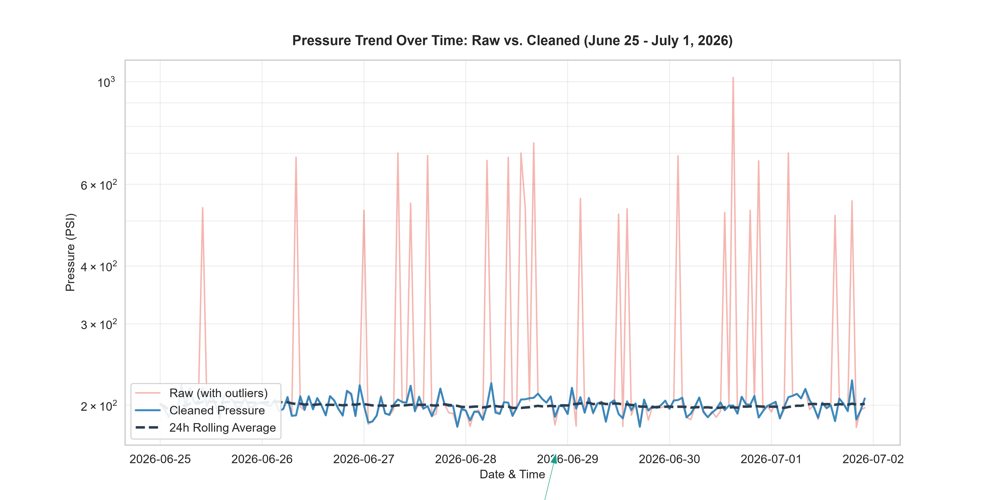

# Industrial Sensor Log: Data Wrangling & Time-Series Analysis

This repository contains a complete Python Jupyter Notebook showing the ingestion, profiling, cleaning, analysis, and visualization of a week of operational data from a fictional processing plant. The dataset (`ops_sensor_log_dirty.csv`) simulates raw sensor logs containing structural inconsistencies, missing values, duplicates, and extreme sensor outliers.

## Project Structure

* **`week2_data_wrangler.ipynb`**: The primary Jupyter Notebook containing the data ingestion, profiling, cleaning pipeline, time-series analysis, aggregation, and plotting.
* **`ops_sensor_log_dirty.csv`**: The raw, "dirty" operational sensor log dataset.
* **`pressure_comparison.png`**: The final output visualization comparing the raw and cleaned pressure trends over time.
* **`Week2_Insight_Report_Inuka.pdf`**: Associated insight report summarizing the workflow and analytical findings.

---

## 1. Data Health Report

An initial profiling of the raw operational data (`ops_sensor_log_dirty.csv`) revealed several critical data quality issues:

1. **Extreme Sensor Outliers & Dropouts:**
   * **Pressure (PSI):** Standard operating range is roughly $120$ to $280$ PSI. However, the raw data contains extreme spikes up to $15,000$ PSI and $9,999$ PSI, along with dropouts of $-50$ PSI and exactly $0.0$ PSI. These invalid readings skew the average pressure ($255.25$ PSI instead of the actual average of $\approx 200$ PSI).
   * **Temperature (°C):** Plausible range is $45$ to $85$ °C. The data contains outlier spikes up to $1,500$ °C and $800$ °C, alongside absolute zero dropouts ($-273.15$ °C) and exactly $0.0$ °C.
2. **Categorical Inconsistencies:**
   * The **`Zone`** column contains 15 unique category variations representing the same physical areas due to inconsistent casing and spaces (e.g., `'Zone_South'`, `'ZONE_SOUTH'`, `'z_south'`, `' South Zone'`, `'zone south'`).
   * The **`Shift`** column has $53$ missing values and contains noisy labels that do not match the actual logging hours.
3. **Missing Data:**
   * Null values were present across multiple columns: `Zone` (31), `Shift` (53), `Pressure_PSI` (40), `Temperature_C` (40), and `Flow_Rate_LPM` (49).
4. **Duplicates & Date Typos:**
   * **Duplicates:** There are $15$ exact duplicate rows representing redundant logs.
   * **Date Typo:** A single timestamp typo (`2026-01-07 09:10:00`) lies six months before the rest of the logs (which run from June 25 to July 1, 2026). This is a date typo where the month and day were swapped (it should be July 1st, `2026-07-01`).

---

## 2. Data Cleaning Pipeline

The reusable cleaning function `clean_ops_data(df)` processes the raw dataset through the following steps:

* **Timestamp Standardization:** Converts timestamps to datetime objects and corrects the swapped month/day typo (`January 7` $\rightarrow$ `July 1`). The dataset is then sorted chronologically.
* **Duplicate Removal:** Drops the $15$ duplicate records.
* **Categorical Standardization:**
  * normalizes all **`Zone`** names using lowercase string matching and stripping to map them into 5 standard categories: `Zone_South`, `Zone_North`, `Zone_East`, `Zone_West`, and `Zone_Central`.
  * **Missing Zone Handling:** Since `Zone` is a critical categorical feature for downstream spatial analysis, rows with missing `Zone` values (31 rows, ~0.6% of data) are dropped.
  * **Shift Re-Assignment:** Recalculates the `Shift` based on the hour of the timestamp to correct noisy inputs and fill missing values:
    * **Morning:** 6:00 AM – 1:59 PM (6:00 to 13:59)
    * **Afternoon:** 2:00 PM – 9:59 PM (14:00 to 21:59)
    * **Night:** 10:00 PM – 5:59 AM (22:00 to 05:59)
* **Outlier Filtering & Imputation:**
  * Filters out physically impossible readings outside plausible ranges (Pressure: $[100, 300]$ PSI, Temperature: $[40, 90]$ °C, Flow Rate: $[500, 1500]$ LPM) by setting them to `NaN`.
  * **Interpolation Strategy:** Missing values (both original and outlier-induced) are filled using **linear interpolation grouped by `Zone`** to preserve the specific baseline and operating profile of each zone. Forward-fill (`ffill()`) and backward-fill (`bfill()`) are applied to handle boundary values.

---

## 3. Time-Series Analysis

The cleaned dataset is resampled to an **hourly frequency** by calculating the mean of all sensor metrics within each hour. 
To identify operational trends and smooth out short-term fluctuations, a **24-hour rolling average** is computed for the primary metric (`Pressure_PSI`).

---

## 4. Aggregated Statistics Summary

The table below shows the aggregated Mean, Max, and Min values for each sensor metric grouped by **`Shift`** and **`Zone`**:

| Shift | Zone | Pressure (PSI) Mean | Pressure (PSI) Max | Pressure (PSI) Min | Temp (°C) Mean | Temp (°C) Max | Temp (°C) Min | Flow Rate (LPM) Mean | Flow Rate (LPM) Max | Flow Rate (LPM) Min |
| :--- | :--- | :---: | :---: | :---: | :---: | :---: | :---: | :---: | :---: | :---: |
| **Afternoon** | Zone_Central | 198.98 | 279.94 | 120.22 | 65.34 | 84.83 | 45.00 | 1021.07 | 1399.59 | 603.22 |
| | Zone_East | 203.74 | 279.89 | 121.25 | 64.95 | 84.99 | 45.08 | 997.97 | 1398.68 | 603.70 |
| | Zone_North | 201.21 | 278.92 | 120.03 | 64.48 | 84.89 | 45.14 | 994.38 | 1399.61 | 601.09 |
| | Zone_South | 201.08 | 279.72 | 120.22 | 65.12 | 84.99 | 45.05 | 991.43 | 1396.22 | 601.28 |
| | Zone_West | 199.05 | 279.61 | 120.35 | 65.02 | 84.77 | 45.07 | 1011.03 | 1397.89 | 608.80 |
| **Morning** | Zone_Central | 201.94 | 279.67 | 120.17 | 65.86 | 84.67 | 45.40 | 1005.77 | 1399.15 | 600.82 |
| | Zone_East | 199.25 | 279.95 | 120.16 | 64.69 | 84.75 | 45.56 | 984.88 | 1398.44 | 602.63 |
| | Zone_North | 202.48 | 279.85 | 121.29 | 65.87 | 84.67 | 45.24 | 1002.42 | 1393.85 | 601.80 |
| | Zone_South | 202.05 | 279.43 | 120.25 | 65.55 | 84.84 | 45.01 | 980.12 | 1392.80 | 603.17 |
| | Zone_West | 199.59 | 279.90 | 120.25 | 63.78 | 84.38 | 45.01 | 987.01 | 1399.76 | 600.23 |
| **Night** | Zone_Central | 198.81 | 279.92 | 120.43 | 64.76 | 84.77 | 45.05 | 1000.69 | 1395.04 | 600.69 |
| | Zone_East | 201.40 | 278.98 | 120.86 | 65.69 | 84.80 | 45.15 | 1001.89 | 1394.97 | 601.61 |
| | Zone_North | 203.07 | 279.96 | 120.70 | 64.03 | 85.00 | 45.03 | 1008.68 | 1398.37 | 600.01 |
| | Zone_South | 196.66 | 279.72 | 121.29 | 64.88 | 84.93 | 45.23 | 1002.54 | 1399.40 | 600.27 |
| | Zone_West | 192.42 | 277.87 | 120.29 | 64.30 | 84.81 | 45.05 | 1010.76 | 1399.38 | 609.68 |

---

## 5. Visualization

The plot below compares the raw operational data with the cleaned pressure trend over time. Due to the massive differences between standard operating values and raw spikes (up to $15,000$ PSI), a log scale is used on the Y-axis to clearly show both the outliers and the stabilized process range:



---

## 6. How to Run

### Prerequisites

Ensure you have Python installed along with the following libraries:
```bash
pip install numpy pandas matplotlib seaborn jupyter
```

### Execution

1. Clone this repository.
2. Open the notebook in Jupyter:
   ```bash
   jupyter notebook week2_data_wrangler.ipynb
   ```
3. Run all cells to execute the data wrangling pipeline, regenerate the statistics, and display the comparison plots.
